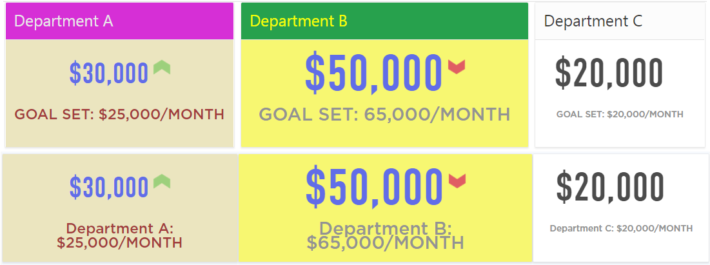

# Oracle APEX Region Type Plugin - KPI Numeric Card

Region type plugin for displaying responsive kpi numeric cards. Fully customizable, including coloring, font-size to display target metric in your own custom styles.

## Documentation

## Donate

## Changelog

#### 1.0 - Initial Release

## Install
- Import plugin file "region_type_plugin_com_planetapex_kpi_numeric_cards.sql" from source directory into your application
- (Optional) Deploy the CSS/JS files from "src" directory on your webserver and change the "File Prefix" to webservers folder.

## Preview

## Demo Application
[KPI Numeric Card Application](https://apex.oracle.com/pls/apex/f?p=83009:50 "KPI Numeric Card Homepage")
